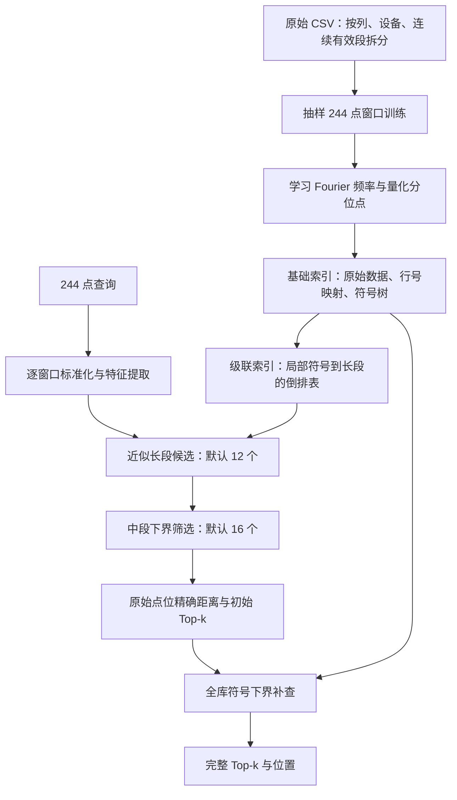

# 时间序列检索 V2：模型结构、使用与跨设备迁移

本文对应当前 `rag-search-v2` 实现，包含默认开启的完整召回补查。所有相对路径和命令都假定当前工作目录是 `rag-search-v2`。

文档验证：五段 Python 示例已通过语法检查；第 6、7 节的自定义建库和查询脚本已在本设备用独立模拟 CSV 实际运行通过，得到完整 Top-10，原查询的最佳距离为零。该检查不替代目标设备上的安装与回归测试。

## 1. 先明确这个系统是什么

这是一个**学习形状特征和量化边界的时间序列检索索引**，不是大语言模型，也不是端到端神经网络或已训练的 LLM agent。

- 输入：长度 **244** 的一维有限数值序列。
- 检索对象：每个数值列、每个设备的连续序列中的所有合法 244 点窗口，起点步长为 **1**。
- 输出：Top-k 近邻、原文件、数值列、设备、序列起点、原始 CSV 行号，以及可选的匹配数值。
- 当前主距离：每段分别标准化后的欧氏距离，即比较**形状**。
- 默认策略：长段近似路由 → 中段筛选 → 原始点位核验 → 全库安全补查。
- 默认 `verification="scan"`，完成后 `certified=true`；`verification="none"` 是旧的近似模式。

查询在线访问转换后的索引原始存储 `raw.bin`，不会每次重新读取 CSV。

### 1.1 当前效果与边界

当前实际测试平台为 Windows 11 x64、Python 3.14.3。验证库约 103 万原始数值点、1,023,529 个合法起点，包含项目开发子集和一个完整 GPU CSV。

- 70 个随机原片段查询：默认完整补查 Top-10 距离召回逐条为 100%；中位约 43 ms、P95 约 96 ms、最慢约 224 ms。
- 35 次独立本机 HTTP 查询：距离召回逐条为 100%；中位约 57 ms、最慢约 106 ms。
- 以上不包含服务启动时间，不是多客户端吞吐压测。
- **尚未完成全部原始 CSV 或百亿原始点测试，也没有每次查询 <100 ms 的硬保证。**

完整数据见 [完整召回报告](CERTIFIED_REPORT.md)。迁移后须重新测量，不要把旧设备耗时作为新设备的承诺。

## 2. 模型与检索结构



### 2.1 标准化与距离

对一个窗口 x：先减去首点以降低大数值偏置的影响，再减去均值、除以标准差。标准差不超过 `1e-10` 的窗口视为常量，映射到零向量。

```text
z(x) = (x - mean(x)) / std(x)
d(q,x) = sqrt(sum((z(q)[i] - z(x)[i])²))
```

这意味着正比例缩放或整体平移后的同形片段也可能距离为零。例如温度均值不同，但变化形状相同，仍可成为近邻。若任务要求保持原始幅值、温度基线或物理单位差异，当前距离不适用；需要同步修改特征、下界与精确核验，不能只改最后的距离计算。

### 2.2 学习部分：`model.py`

默认 `LearnedShapeModel(length=244, pairs=16, paa=16)`。

| 部分 | 默认结构 | 是否训练 |
|---|---|---|
| Fourier 特征 | 在非 DC、非 Nyquist 频率中选择方差较大的 16 对频率；实部/虚部共 32 维 | 学习频率选择 |
| PAA 分段均值特征 | 244 点分为 16 个相邻区间，每段采用带长度权重的均值摘要 | 分段方式固定 |
| 量化器 | 每维学习 255 个分位点，划分为 256 个符号区间 | 学习量化边界 |
| 合计 | 48 维，每维一个 `uint8` 符号 | — |

模型文件：`model/model.json` 保存长度、维数、训练说明，`model/model.npz` 保存频率和量化边界。更换训练数据后建议重新训练，并重建两个索引。**不能单独替换旧索引里的模型文件。**

Fourier 与 PAA 都是从同一个窗口得到的投影。精确剪枝用两种距离下界的**最大值**，不把两个下界直接相加，避免重复计算同一部分信息。

### 2.3 基础索引：`index.py`、`tree.py`

- 每个合法起点编码，窗口可以在原始长序列的任意位置开始。
- 相邻且符号、常量标记均相同的起点合并为起点区间，保存为 RLE 记录；原始数据只保存一次，流式块之间带必要重叠。
- 全局目录树 → 分片符号树 → 起点区间 → 原始数据精确计算。
- `raw.bin` 保存 float64 原始值，`rows.bin` 或紧凑线性映射用于追溯 CSV 行号。
- 每个有限连续数据块都是内部 `sid`，一个 CSV 列可能对应多个 `sid`。

基础索引构建时的默认分片记录上限为 250,000，树叶默认 256 条记录；它们不是原始采样点数。

### 2.4 三级候选索引：`cascade.py`

| 层级 | 默认参数 | 做什么 |
|---|---|---|
| 长段路由 | 16,384 个合法窗口起点/长段，保留 12 个候选 | 使用四张六维符号倒排表；每维粗量化为八档；匹配键和相邻档位按稀有度加权投票 |
| 中段筛选 | 1,024 个起点/中段，保留 16 个候选 | 用完整符号摘要计算距离下界，按中段最小下界排序 |
| 点位核验 | 候选中段内所有合法起点 | 计算 244 点标准化欧氏距离，得到初始 Top-k |

**长段不是单个整体向量。** 每个长段包含多个局部形状符号，避免 244 点目标被整个长段的平均特征淹没。

16,384 和 1,024 按“窗口起点”分组。核验时继续读取该起点之后的 243 点，因此跨中/长段边界的窗口也能检索。CSV 流式读取本身也保留 243 点衔接。

当前倒排构造固定使用前 24 个特征，默认 32 维 Fourier 已足够。自定义模型总维数少于 24 时不能直接使用该构造。首次迁移建议保持 `pairs=16, paa=16`。

### 2.5 完整召回补查

近似层本身可能遗漏全库近邻，因此默认增加补查：

1. 用初始 Top-k 的第 k 名真实距离作为上限 τ。
2. 检查全库符号摘要的距离下界 L。
3. 仅在 L > τ 时安全跳过；否则核验原始窗口，并更新 Top-k 和 τ。

| `verification` | 行为 | 返回语义 |
|---|---|---|
| `scan`（默认） | 查表、提前终止的全库符号检查，按需核验原始点位 | 完成后 `certified=true` |
| `tree` | 以初始候选为上限，用基础精确树补查 | 完成后 `certified=true` |
| `none` | 只保留三级近似候选 | `certified=false`，可能漏全库 Top-k |

`scan` 仍有最坏 O(N) 的符号扫描，不能当成数据库规模无关的查询。它减少原始距离计算，但百亿点需要进一步设计分片和区域剪枝。

`certified=true` 的范围是**当前已完成索引、固定距离与浮点容差、任取 k 个距离并列结果**。它不是“指定来源一定出现”：大量重复/常量窗口可以具有相同距离，Top-10 不一定包含你指定的那个来源。测试距离容差为 `2e-5`；符号下界每维向外留有 `1e-4` 余量。

## 3. 需要复制哪些文件

最简单的方法是复制整个 `rag-search-v2`，但可以不复制体积较大的历史结果。最小运行文件如下：

```text
rag-search-v2/
  model.py              学习特征和量化模型
  kernels.py            Python 调用本地 C 库
  native.c              数值计算内核源码
  build_native.py       C 库编译脚本
  tree.py               符号树
  index.py              基础索引建库与精确搜索
  data.py               CSV 读取与行号映射
  cascade.py            长段/中段/点位检索与补查
  run.py                原有建库和基础查询命令
  serve.py              常驻 HTTP 服务
  test_index.py         基础回归测试
  test_cascade.py       级联与缓存回归测试
  benchmark_cascade.py  对照实验和绘图
  plot_retrieval.py     查询/结果叠加图
```

若要继续使用现有数据，还应复制：

```text
results/validation_index/    必须是完整目录，包括 model、raw、行号和全部树/分片
results/cascade_index/       可选：可以在新设备从基础索引重新生成
```

不要只复制 `model.npz`；模型文件不包含原始数据和索引。已完成索引不需要 `staging/` 来查询。不要把尚未完成的建库目录当作可查询数据库。

原始 CSV 可不随已有索引一起迁移，查询用的是 `raw.bin`。但来源路径仍会显示旧 CSV 路径；若需重新建库、对照原始 CSV 或展示时间戳，则应另行复制相应原始文件。

## 4. 新设备安装环境

### 4.1 Python 依赖

已测试版本：

```text
Python      3.14.3 x64
numpy       2.5.2
scipy       1.18.0
pandas      3.0.5
matplotlib  3.11.1
```

没有 PyTorch、CUDA 或 GPU 的运行依赖，GPU CSV 只是数据来源名称。首次迁移建议建立独立虚拟环境。以下 `python` 应指向你新设备的 Python，而不是旧设备的 `C:\Python314\python.exe`。

Windows PowerShell：

```powershell
python -m venv .venv
.\.venv\Scripts\python.exe -m pip install numpy scipy pandas matplotlib
.\.venv\Scripts\python.exe -m pip freeze > environment-new-device.txt
```

Linux shell：

```bash
python3 -m venv .venv
.venv/bin/python -m pip install numpy scipy pandas matplotlib
.venv/bin/python -m pip freeze > environment-new-device.txt
```

下文统一写 `python`。可以激活虚拟环境，也可以将命令里的 `python` 替换成虚拟环境解释器完整路径。不同版本和 Linux/macOS 尚未在此项目实测，必须重新运行测试，不能仅凭安装成功认为迁移通过。

### 4.2 编译本地计算库

需要目标设备可用的 **C11 编译器**。仓库脚本使用 `CC` 环境变量指定的编译器，未指定时在 PATH 中查找 `gcc`。已移除旧设备的 E 盘回退路径；`CC` 只填可执行文件路径，不包含额外参数。

Windows：安装/准备与 Python 架构匹配的 MinGW-w64 GCC，将其 `bin` 加入 PATH，再执行：

```powershell
gcc --version
python build_native.py
```

Linux 有 GCC 时：

```bash
gcc --version
python build_native.py
```

输出在项目目录：Windows 为 `native.dll`，非 Windows 为 `native.so`。`kernels.py` 会从其自身所在目录加载该文件。不要将 Windows DLL 复制到 Linux 使用，也不要混用 x86/x64/ARM 库。

也可手动编译，参数与当前脚本一致：

```bash
gcc -O3 -std=c11 -shared -fPIC native.c -o native.so -lm
```

Windows 将输出名改为 `native.dll`。macOS/Clang 的链接参数和动态库依赖需要在目标系统验证，当前没有 macOS 验证结果。

不要自行添加 `-ffast-math`：精确剪枝依赖保守数值行为。Windows 更新 DLL 前应停止加载旧 DLL 的服务进程。出现找不到模块错误时，还要检查编译器运行库是否在 DLL 搜索路径中。

### 4.3 首先跑回归测试

```bash
python -m unittest -v test_cascade.py test_index.py
```

当前为五项测试，覆盖符号下界、编码、精确搜索、跨段/末尾位置、64 位逻辑位置，以及统计量缓存与直接计算一致性。测试不需要旧项目 CSV，会生成合成数据。

## 5. 迁移现有索引

### 推荐方法：基础索引复制，级联索引重新构建

假定在新设备已经有 `results/validation_index`：

```bash
python cascade.py build --base results/validation_index --output results/cascade_migrated
```

输出目录必须不存在。然后查询时使用 `results/cascade_migrated`，不需要重读原始 CSV 或重新训练模型。

### 可选方法：保留原级联库，只修正基础路径

`results/cascade_index/manifest.json` 中的 `base` 是旧设备的绝对路径。在新设备上，仅将它改成新基础索引路径。可在项目目录用 Python 执行：

```python
import json
from pathlib import Path

manifest = Path("results/cascade_index/manifest.json")
info = json.loads(manifest.read_text(encoding="utf-8"))
info["base"] = str(Path("results/validation_index").resolve())
manifest.write_text(json.dumps(info, ensure_ascii=False, indent=2), encoding="utf-8")
```

**不要顺手改基础索引 `manifest.json` 中的来源路径。** 级联索引保存了基础 manifest 的 SHA-256，基础 manifest 的任何字节变化都会触发 `Base index changed`。若确实修改了基础 manifest，应从修改后的基础索引重新构建级联库，不能仅伪造新的哈希绕过检查。

## 6. 测试你自己的 CSV 数据集

### 6.1 数据格式与预处理约定

最简单的 CSV：

```csv
timestamp,value
2026-01-01 00:00:00,10.2
2026-01-01 00:00:01,10.5
2026-01-01 00:00:02,10.1
```

上面只示意格式；实际每段至少要有 244 个连续有效点，训练示例还需要更长的段。

当前 `csv_runs` 的具体行为：

- 每个数值列分别建一维序列；不是多变量联合检索。
- 排除列名（不区分大小写）：`date`、`timestamp`、`time`、`datetime`、`gpu_index`、`index`。
- 若有 `gpu_index`，按设备分组；其他名字的设备列不会自动识别。应先重命名/预处理，或修改 `data.py`。
- 其他列尝试转为数值，非数值、NaN、Inf 会切断连续段，长度不足 244 的段不会建索引。
- 保持 CSV 中原有行顺序，不自动按时间排序、不按时间间隔补点。时间戳中间有大缺口但数值有限时，不会自动断段。
- 支持一个 CSV 中多设备交错行，但每个设备自身的行顺序必须已符合时间顺序。
- 默认逗号分隔并按 pandas 默认编码读取；特殊分隔符/编码需要调整读取参数或先转换。
- CSV 行号以数据行 **0 起算，不含表头**；`source_row_end` 为右端不含。交错设备的行号不一定连续，起止行只是范围，不表示范围内每行都属于该设备。

注意：`run.py build-validation` 会截取开发子集，并按旧 GPU 文件名挑选数据，**不适合作为任意新数据集的通用入口**。原 `build-csv` 默认也带 `D:\workload\gpu`，且项目目录只匹配一层 `*/*.csv`。建议使用下面独立示例，明确递归枚举自己的 CSV。

### 6.2 通用新数据建库示例

将下面代码保存为项目目录下的 `build_custom.py`，只修改 `CSV_ROOT` 和两个输出目录。它复用当前的数据解析、训练与建库实现，不要求六类旧数据集目录结构。

```python
import os
os.environ.setdefault("OPENBLAS_NUM_THREADS", "1")

from pathlib import Path
import numpy as np
from data import csv_runs
from model import LearnedShapeModel
from index import IndexBuilder
from cascade import Cascade

CSV_ROOT = Path("my_csv").resolve()   # 修改为自己的数据根目录
BASE = Path("results/custom_base")
CASCADE = Path("results/custom_cascade")

paths = sorted(CSV_ROOT.rglob("*.csv"))
if not paths:
    raise RuntimeError(f"未找到 CSV: {CSV_ROOT}")
if BASE.exists() or CASCADE.exists():
    raise RuntimeError("请使用新的输出目录，避免覆盖旧实验")

files = [dict(path=str(p.resolve()), bytes=p.stat().st_size,
              mtime_ns=p.stat().st_mtime_ns, group=p.parent.name)
         for p in paths]

# 第一遍：小规模训练样本。最多 4096 个窗口；每个连续段最多抽 8 个。
# 这是可运行的起步方案，先枚举到的文件可能占据更多训练样本。
# 正式实验应按设备/数据类别平衡抽样并保存训练来源。
rng = np.random.default_rng(20260915)
samples = []
for file in files:
    for x, meta, rows in csv_runs(file):
        stop = int(len(x) * 0.55) - 244 + 1
        if stop <= 0:
            continue
        for _ in range(min(8, 4096 - len(samples))):
            start = int(rng.integers(stop))
            samples.append(x[start:start + 244].copy())
        if len(samples) >= 4096:
            break
    if len(samples) >= 4096:
        break
if len(samples) < 10:
    raise RuntimeError("训练样本不足：至少 10 个窗口，需要足够长的有效连续段")

model = LearnedShapeModel(length=244, pairs=16, paa=16).fit(
    np.asarray(samples), seed=20260915)

# 第二遍：完整读取选定 CSV；这里不限制列数、文件数或行数。
builder = IndexBuilder(BASE, model)
emitted = 0
for file in files:
    for x, meta, rows in csv_runs(file):
        builder.add(x, meta, rows)
        emitted += 1
    print("已读取", file["path"], flush=True)
if emitted == 0:
    raise RuntimeError("没有长度 >=244 的有限连续段")
manifest = builder.finish(dict(
    description="Custom CSV corpus", files=files,
    full_selected_corpus=True))
print("合法起点数:", manifest["windows"])

# 第三步：从基础索引建立长段倒排路由和中段摘要。
print(Cascade.build(BASE, CASCADE))
```

运行：

```bash
python build_custom.py
```

此示例不实现应用级中断恢复，失败后请检查错误原因，并使用新输出目录重试；不要把失败目录当作完成库。基础 `run.py build-csv --resume` 有单独的 checkpoint 路径，但自定义脚本没有接入它。

内存注意：基础建库使用分批数据，但级联 `Cascade.build` 当前会在内存汇总符号和倒排项。首次迁移先用小数据验证；不能把这个脚本直接当作百亿点的生产建库流程。

### 6.3 仅复用已有训练模型

若暂时不想重新训练，在自定义脚本里用下面一行替换训练部分：

```python
model = LearnedShapeModel.load("results/validation_index/model")
```

仍需对新数据重建基础索引与级联索引。旧模型可以运行，但新分布可能使路由选择和剪枝效果变差；完整补查仍需完成，查询耗时可能增加。

## 7. 生成查询、运行检索并保存结果

推荐通过 Python 保存 JSON，避免不同 PowerShell 版本的输出重定向编码差异。保存以下脚本为 `query_custom.py`：

```python
import os
os.environ.setdefault("OPENBLAS_NUM_THREADS", "1")

import json
import time
from pathlib import Path
import numpy as np
from cascade import Cascade

out = Path("results/custom_query")
out.mkdir(parents=True, exist_ok=True)

engine = Cascade("results/custom_cascade")   # 初始化/统计量缓存，计时之外
try:
    rng = np.random.default_rng(20260920)
    # 挑一个足够长的连续段，在后 35% 范围随机截取。
    eligible = [i for i, s in enumerate(engine.idx.manifest["series"])
                if s["n"] >= 800]
    if not eligible:
        raise RuntimeError("本示例需要至少一个长度 >=800 的连续段")
    sid = int(rng.choice(eligible))
    x = engine.idx.values(sid)
    start = int(rng.integers(int(len(x) * 0.65), len(x) - 244 + 1))
    values = x[start:start + 244].copy()
    meta = engine.idx.manifest["series"][sid]
    query = dict(values=values.tolist(), sid=sid, local_start=start,
                 expected_start=int(meta.get("start", 0)) + start,
                 source=meta.get("source"), column=meta.get("column"),
                 device=meta.get("device"))
    (out / "query.json").write_text(
        json.dumps(query, ensure_ascii=False, indent=2), encoding="utf-8")

    began = time.perf_counter()
    result = engine.search(values, k=10, long_candidates=12,
                           mid_candidates=16, verification="scan",
                           include_values=True)
    text = json.dumps(result, ensure_ascii=False, indent=2)
    wall_ms = (time.perf_counter() - began) * 1000
    (out / "result.json").write_text(text, encoding="utf-8")
    print("查询及序列化耗时 ms:", wall_ms)
    print("完整检索:", result["certified"])
    for hit in result["hits"]:
        print(hit["source"], hit.get("column"), hit.get("device"),
              hit["start"], hit["distance"])
finally:
    engine.idx.close()
```

`engine.search` 只接收查询数值，不接收或使用上面保存的 `expected_start`；来源信息只用于评估，避免将答案泄漏给检索。

运行及绘图：

```bash
python query_custom.py
python plot_retrieval.py --query results/custom_query/query.json --result results/custom_query/result.json --index results/custom_base --output results/custom_plots
```

生成三组 PNG/SVG：查询与 Top-1 的原始值/差值图、Top-10 标准化形状图、最佳结果在来源长段中的位置图。若 Linux 中文字体缺失，安装可用中文字体，或修改脚本的字体候选与标题文本。

也可以直接用已有 JSON 查询，文件内容可为 244 个数值的数组，或包含 `values` 数组的对象：

```bash
python cascade.py query --index results/custom_cascade --query-json results/custom_query/query.json --verification scan
```

命令行每次启动都会重新加载和准备缓存，不能拿整个进程运行时间与常驻查询毫秒数比较。

## 8. 常驻服务方式

启动：

```bash
python serve.py --index results/custom_base --cascade-index results/custom_cascade --port 8770
```

监听地址当前固定为 **127.0.0.1**，适合目标设备本机测试。不会自动开放远程访问。服务是单进程串行原型，没有认证与多用户吞吐保证；若修改为对外监听，需要另行处理访问控制与部署。

在另一个 Python 进程请求：

```python
import json
import urllib.request
from pathlib import Path

q = json.loads(Path("results/custom_query/query.json").read_text(encoding="utf-8"))
payload = dict(query=q["values"], k=10, long_candidates=12,
               mid_candidates=16, verification="scan", include_values=True)
request = urllib.request.Request(
    "http://127.0.0.1:8770/search",
    data=json.dumps(payload).encode("utf-8"),
    headers={"Content-Type": "application/json"})
with urllib.request.urlopen(request, timeout=30) as response:
    result = json.load(response)
print(result["certified"], result["hits"][0]["start"])
```

### 8.1 关键结果字段

| 字段 | 含义 |
|---|---|
| `hits` | 排序后的匹配结果 |
| `hits[].source / column / device` | 来源文件、数值列与设备 |
| `hits[].sid / local_start` | 内部连续段编号，以及该段中的局部起点 |
| `hits[].start` | 该来源列/设备序列中的逻辑起点，不一定等于 CSV 行号 |
| `source_row_start / source_row_end` | 原始 CSV 数据行范围，0 起算、右端不含 |
| `distance / squared_distance` | 标准化欧氏距离及其平方 |
| `values` | `include_values=true` 时包含匹配的原始数值 |
| `certified` | 是否完成当前索引、指定距离下的完整搜索 |
| `initial_ms / verification_ms` | 初始候选阶段与补查阶段耗时 |
| `total_ms` | 检索方法内部耗时；不包括 HTTP 往返和客户端序列化 |
| `positions_verified / verification_positions` | 初始阶段与补查阶段核验数，可有重复，不是全局唯一核验位置计数 |

级联模式不执行 `budget_ms` 强制截止。需要完整召回时，不能到 100 ms 就停止并继续声称完整；若必须截止，应明确返回未完成结果，这需要额外实现。

## 9. 在新设备上做可比较的实验

下面命令接受新的基础/级联索引，不依赖旧 GPU 查询文件：

```bash
python benchmark_cascade.py --index results/custom_cascade --certify --per-group 10 --output results/custom_benchmark
```

每组取十个原片段，比较原精确树、近似级联、树补查、符号补查，并以 FFT 全库距离结果对照。输出逐条 `metrics.json`、延迟/召回图和匹配图。基准按 `group` 分组；如果所有 CSV 都在同一目录，默认只有一个组，可增大 `--per-group`。

注意事项：

1. 数据集规模较大时，全量 FFT 对照本身也昂贵，应先在可穷举子集验证正确性，再做大规模时延测试。
2. 保存随机种子、依赖版本、CPU/内存/系统信息、原始点数、合法窗口数、模型维数和候选参数。
3. 区分冷启动、常驻查询、HTTP 往返和并发排队耗时，至少报告 P50、P95、最大值和超时数。
4. 区分“距离 Recall@k”和“指定来源命中”。基准允许同距离并列，固定 k 不保证返回全部重复来源。
5. 目前基准只测试原片段；对加噪、平移、缩放、其他采样率或时间变形的需求，应建立单独查询集。
6. 查询长度在当前数据管道与基准中多处固定为 244；不要只改 `model.length` 就认为支持可变长度。

`smoke_cascade_http.py` 是旧开发库专用回归脚本，带原索引路径、端口和旧 GPU 查询路径。迁移到新数据时使用第 8 节的通用 HTTP 请求示例，或修改此脚本的这些路径；不要直接运行后把旧数据测试误认为新数据测试。

## 10. 需要特别检查的本机路径与限制

| 位置 | 当前行为 | 迁移处理 |
|---|---|---|
| `build_native.py` | 优先使用 `CC`，其次从 PATH 查找 gcc | 将新编译器加入 PATH，或设置 `CC` |
| `run.py` | 数据目录有旧 `D:\workload\gpu` 默认值 | 显式传参数，或用第 6 节自定义脚本 |
| `data.py: validation_data` | 依赖旧 GPU 文件名和开发截取策略 | 新数据不用 `build-validation` |
| 级联 `manifest.json: base` | 基础索引绝对路径 | 重建级联库或修正此字段 |
| 基础 manifest 的 `source` | 保存原 CSV 绝对路径 | 可保留作来源标签；修改后应重建级联库 |
| `plot_retrieval.py` | 默认旧查询与结果路径 | 指定全部输入/输出参数 |
| `smoke_cascade_http.py` | 旧开发库专用 | 新数据使用通用请求示例 |

## 11. 常见问题

**`native.dll` / `native.so` 找不到或无法加载**

先在目标设备编译；确认 Python 与库架构一致、文件位于 `kernels.py` 同目录、运行库依赖可找到。编译前不要运行会提前导入 `kernels.py` 的建库命令。

**`Base index changed`**

基础 manifest 与级联库记录的指纹不一致。确认没有混用实验目录；从正确基础索引重建级联库，不要绕过检查。

**`Expected 244 finite query values`**

输入长度不等于 244，或者含 NaN/Inf。检查传的是一个数值列的一段序列，不是 CSV 所有列摊平后的数组。

**`No sufficiently long training runs` 或自定义脚本训练不足**

数据太短、非数值内容多、缺失值切断太多，或设备分组不正确。索引需要连续 244 点；本文训练抽样使用前 55%，所以训练段需要更长。不要把缺失值随意填零后当作同一个实验。

**查询找回形状但数值高低不同**

当前比较每段独立标准化后的形状，属于预期行为。看原始值图和标准化图两种视角。

**召回 100%，却没有返回我指定的那条源记录**

先看是否存在重复/常量片段或同距离并列。当前完整性是距离 Top-k，不是枚举全部相同来源。

**新设备比报告慢很多**

先排除把进程启动、缓存准备、建库、FFT 对照和查询混在一起计时；检查是否从网络盘加载、内存不足、并发进程争用。随后再比较同查询参数与相同精度模式。

**是否已经能迁移到百亿点生产环境？**

不能这样宣称。级联建库仍在内存汇总，查询补查最坏扫描全库符号，并额外缓存每起点两项统计量。当前迁移文档面向可重复的数据集实验，不是经过百亿点容量、恢复和并发压测的生产部署指南。

## 12. 最短执行清单

1. 复制源码，创建 Python 环境并安装四个依赖。
2. 在新设备编译 `native.dll` / `native.so`，运行五项测试。
3. 选择：复制完整基础索引，或用自己的 CSV 重新训练并建立基础索引。
4. 从正确基础路径建立新的级联库。
5. 使用 Python API 或常驻 HTTP 服务查询，默认 `verification="scan"`。
6. 用 `benchmark_cascade.py --certify` 重新测量精度和延迟。
7. 用 `plot_retrieval.py` 对比查询、Top-10 与来源位置。
