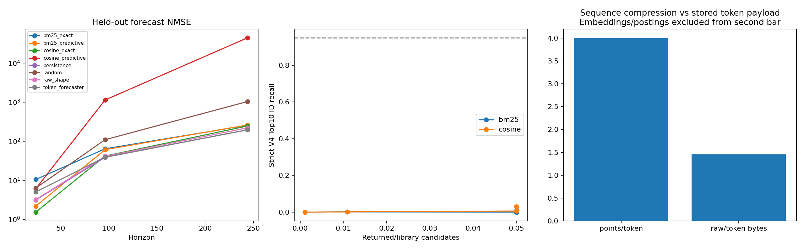

# V5 服务器实验分析

有效查询 64；划分 test。

## 三个问题

1. 压缩：4.000 点/Token；包含 code、duration、mean、std 后，原始 float32/Token 负载比仅 1.455。整个索引 48,256,064 bytes，还包含重叠窗口、读出向量和 postings。
2. 码本使用 16/256；困惑度 5.10。码本熵不是已经实现的熵编码压缩率。
3. 检索和预测：下表报告真正的 sampled library 搜索；不是只在教师候选池里重排后宣称全库召回。先看 coverage，stride 较大时精确起点缺失会限制 Recall。

## 预测

| H | 方法 | 平均 NMSE | 相对 persistence skill | 胜率 |
|---:|---|---:|---:|---:|
| 24 | bm25_exact | 10.472 | -2.348 | 0.312 |
| 24 | bm25_predictive | 2.1784 | 0.303 | 0.344 |
| 24 | cosine_exact | 1.5264 | 0.512 | 0.266 |
| 24 | cosine_predictive | 6.0765 | -0.943 | 0.234 |
| 24 | persistence | 3.1273 | 0.000 | 0.000 |
| 24 | random | 6.3031 | -1.015 | 0.250 |
| 24 | raw_shape | 3.1962 | -0.022 | 0.266 |
| 24 | token_forecaster | 5.0161 | -0.604 | 0.266 |
| 96 | bm25_exact | 63.863 | -0.655 | 0.484 |
| 96 | bm25_predictive | 60.632 | -0.571 | 0.531 |
| 96 | cosine_exact | 41.723 | -0.081 | 0.484 |
| 96 | cosine_predictive | 1134 | -28.387 | 0.500 |
| 96 | persistence | 38.587 | 0.000 | 0.000 |
| 96 | random | 109.22 | -1.830 | 0.406 |
| 96 | raw_shape | 40.914 | -0.060 | 0.312 |
| 96 | token_forecaster | 39.054 | -0.012 | 0.594 |
| 244 | bm25_exact | 255.82 | -0.306 | 0.609 |
| 244 | bm25_predictive | 260.22 | -0.328 | 0.562 |
| 244 | cosine_exact | 245.32 | -0.252 | 0.625 |
| 244 | cosine_predictive | 44311 | -225.183 | 0.594 |
| 244 | persistence | 195.91 | 0.000 | 0.000 |
| 244 | random | 1034.8 | -4.282 | 0.578 |
| 244 | raw_shape | 220.1 | -0.123 | 0.406 |
| 244 | token_forecaster | 195.66 | 0.001 | 0.734 |

## 检索

| 路由 | K | 查询数 | 候选比例 | Recall@K | 库内覆盖上限 |
|---|---:|---:|---:|---:|---:|
| bm25 | 10 | 64 | 0.0011 | 0.0000 | 0.0688 |
| bm25 | 100 | 64 | 0.0109 | 0.0016 | 0.0688 |
| bm25 | 398 | 16 | 0.0500 | 0.0000 | 0.0625 |
| bm25 | 441 | 16 | 0.0500 | 0.0000 | 0.0625 |
| bm25 | 454 | 16 | 0.0501 | 0.0125 | 0.0688 |
| bm25 | 574 | 16 | 0.0500 | 0.0063 | 0.0813 |
| cosine | 10 | 64 | 0.0011 | 0.0000 | 0.0688 |
| cosine | 100 | 64 | 0.0109 | 0.0016 | 0.0688 |
| cosine | 398 | 16 | 0.0500 | 0.0063 | 0.0625 |
| cosine | 441 | 16 | 0.0500 | 0.0063 | 0.0625 |
| cosine | 454 | 16 | 0.0501 | 0.0063 | 0.0688 |
| cosine | 574 | 16 | 0.0500 | 0.0312 | 0.0813 |

## 注意解释

- 不自动挑测试集上最好的 K、模型或 horizon。训练 checkpoint 只由 validation forecast NMSE 选择；检索权衡需在 validation 比较，再固定模型测试。
- 同一输入 Token 共享码本，shape/predictive 两个读出头；predictive rerank 只看历史 Token，不读取 query future。
- NMSE 按 query 历史标准差归一化，尺度下限为 memory_std*1e-4 与 1e-6 的较大者；与 V4 按整序列训练方差的指标数值不能直接比较。
- 当前 cosine 是分块全扫描；BM25 是 SQLite unigram/bigram 倒排检索。没有声称 ANN、10B 或每次 <100ms。
- strict teacher-ID Recall 对零距离并列敏感，tie_query_fraction 另行记录。最终 exact 仅核验候选，不能证明库外无更优片段。
- 不同 K 行可能是不同查询集合（小库预算截断）；比较时查看 queries。相同查询所有方法有配对 persistence。
- 置信区间按逻辑序列簇重采样，列之间仍可能相关。raw MSE/MAE 混合不同单位不宜作主结论；优先看分组与 NMSE。

回传 analysis_bundle.zip 即可继续分析；默认不包含原始数据、模型权重、query/true future 数组。