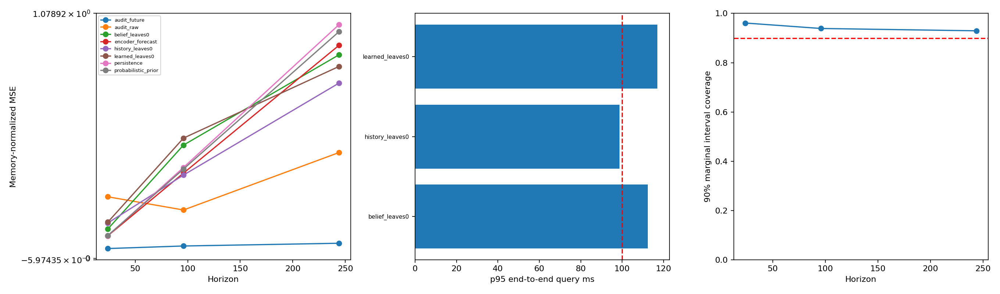

# V6 results

Split: test; queries: 64; checkpoint epoch: 11.

## Forecast (lower NMSE is better)

|H|Method|N|Mean NMSE|Skill vs persistence|Win rate|
|---:|---|---:|---:|---:|---:|
|24|audit_future|4|0.043339|0.818|1.000|
|96|audit_future|4|0.054542|0.798|1.000|
|244|audit_future|4|0.066594|0.796|1.000|
|24|audit_raw|4|0.2713|-0.140|0.500|
|96|audit_raw|4|0.21311|0.211|0.500|
|244|audit_raw|4|0.46616|-0.431|0.250|
|24|belief_leaves0|64|0.1293|-0.299|0.344|
|96|belief_leaves0|64|0.49898|-0.246|0.453|
|244|belief_leaves0|64|0.89679|0.129|0.500|
|24|encoder_forecast|64|0.099426|0.001|0.500|
|96|encoder_forecast|64|0.37551|0.062|0.609|
|244|encoder_forecast|64|0.93854|0.088|0.703|
|24|history_leaves0|64|0.15575|-0.564|0.250|
|96|history_leaves0|64|0.36697|0.084|0.453|
|244|history_leaves0|64|0.77213|0.250|0.594|
|24|learned_leaves0|64|0.15955|-0.602|0.297|
|96|learned_leaves0|64|0.52973|-0.323|0.500|
|244|learned_leaves0|64|0.84548|0.179|0.578|
|24|persistence|64|0.09957|0.000|0.000|
|96|persistence|64|0.40046|0.000|0.000|
|244|persistence|64|1.0296|0.000|0.000|
|24|probabilistic_prior|64|0.10091|-0.013|0.375|
|96|probabilistic_prior|64|0.39362|0.017|0.672|
|244|probabilistic_prior|64|0.99874|0.030|0.656|

NMSE uses memory-only series variance. `history_nmse` is separately retained. Every method has paired persistence values.
Audit methods run on a smaller, seeded subset: compare them on matching query IDs, not against means over all queries.

## End-to-end query latency

|Method|p50 ms|p95 ms|p99 ms|max ms|≤100ms|complete top-k|scored fraction|
|---|---:|---:|---:|---:|---:|---:|---:|
|belief_leaves0|86.14|112.38|148.56|153.79|0.844|1.000|0.8034|
|history_leaves0|78.31|98.64|114.30|116.38|0.953|1.000|0.9604|
|learned_leaves0|73.11|116.96|136.57|138.88|0.938|1.000|0.7383|

## Probability calibration

|H|CRPS (normalized)|Marginal NLL|90% interval coverage|Interval width|
|---:|---:|---:|---:|---:|
|24|0.32013|0.71201|0.961|2.684|
|96|0.78479|1.4928|0.939|5.260|
|244|1.3148|2.0124|0.929|7.606|

## Interpretation

- Evidence for future-aware retrieval requires learned retrieval to beat history retrieval AND persistence on paired test queries; use the no-belief ablation too.
- A calibrated 90% interval should have coverage near 0.9 without excessive width. This does not imply retrieval recall is 90%.
- `future_oracle_id_recall` compares exact starts in the indexed, possibly subsampled library; ties can make this metric pessimistic.
- Greedy non-overlap uses an oversampled bounded heap. Underfilled top-k is explicitly reported, never silently treated as full recall.
- `certified` concerns stored embedding distances only. Budgeted early stopping is approximate. True-future similarity is not guaranteed.
- Bootstrap intervals cluster by series; few series give weak uncertainty estimates. Cross-series calendar alignment is not verified.
- No 10B-point or <100ms claim follows from a small run. Timings exclude process/model/index object loading; first query is retained separately.
- Checkpoint epoch -1 means an untrained smoke fixture, NOT an experiment.

