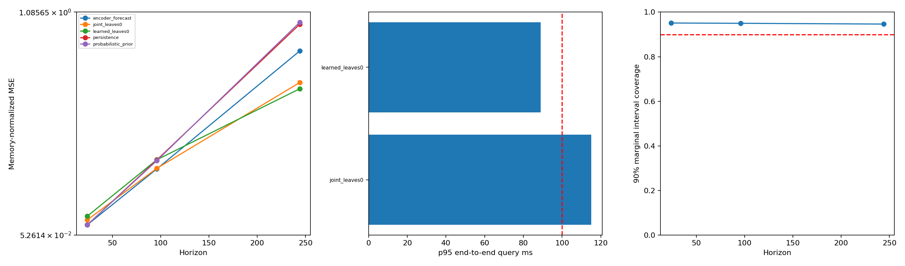

# V6 results

Split: test; queries: 64; checkpoint epoch: 13.

## Forecast (lower NMSE is better)

|H|Method|N|Mean NMSE|Skill vs persistence|Win rate|
|---:|---|---:|---:|---:|---:|
|24|encoder_forecast|64|0.099598|-0.000|0.531|
|96|encoder_forecast|64|0.35875|0.104|0.672|
|244|encoder_forecast|64|0.90563|0.120|0.750|
|24|joint_leaves0|64|0.12255|-0.231|0.328|
|96|joint_leaves0|64|0.36149|0.097|0.453|
|244|joint_leaves0|64|0.75925|0.263|0.562|
|24|learned_leaves0|64|0.13976|-0.404|0.328|
|96|learned_leaves0|64|0.40138|-0.002|0.500|
|244|learned_leaves0|64|0.73035|0.291|0.609|
|24|persistence|64|0.09957|0.000|0.000|
|96|persistence|64|0.40046|0.000|0.000|
|244|persistence|64|1.0296|0.000|0.000|
|24|probabilistic_prior|64|0.099809|-0.002|0.484|
|96|probabilistic_prior|64|0.39709|0.008|0.406|
|244|probabilistic_prior|64|1.0387|-0.009|0.484|

NMSE uses memory-only series variance. `history_nmse` is separately retained. Every method has paired persistence values.
Audit methods run on a smaller, seeded subset: compare them on matching query IDs, not against means over all queries.

## End-to-end query latency

|Method|p50 ms|p95 ms|p99 ms|max ms|≤100ms|complete top-k|scored fraction|
|---|---:|---:|---:|---:|---:|---:|---:|
|joint_leaves0|44.71|115.04|159.18|159.46|0.938|0.938|0.7631|
|learned_leaves0|30.72|88.98|112.07|118.32|0.953|1.000|0.5024|

## Probability calibration

|H|CRPS (normalized)|Marginal NLL|90% interval coverage|Interval width|
|---:|---:|---:|---:|---:|
|24|0.30558|0.50019|0.951|2.777|
|96|0.78776|1.4342|0.950|6.285|
|244|1.3438|2.0732|0.946|9.665|

## Retrieved histories AND futures (per-candidate errors)

|Method|Mean history NMSE|Maximum history NMSE|Mean future NMSE|Queries without matches|
|---|---:|---:|---:|---:|
|learned_leaves0|0.51399|2.6387|13.036|0|
|joint_leaves0|0.20763|0.49966|10.965|0|

Candidate future errors use query-history scale and are not the same metric as memory-normalized aggregate forecast errors. Missing matches are counted separately.

## Interpretation

- Evidence for future-aware retrieval requires learned retrieval to beat history retrieval AND persistence on paired test queries; use the no-belief ablation too.
- A calibrated 90% interval should have coverage near 0.9 without excessive width. This does not imply retrieval recall is 90%.
- `future_oracle_id_recall` compares exact starts in the indexed, possibly subsampled library; ties can make this metric pessimistic.
- Greedy non-overlap uses an oversampled bounded heap. Underfilled top-k is explicitly reported, never silently treated as full recall.
- `certified` concerns stored embedding distances only. Budgeted early stopping is approximate. True-future similarity is not guaranteed.
- Bootstrap intervals cluster by series; few series give weak uncertainty estimates. Cross-series calendar alignment is not verified.
- No 10B-point or <100ms claim follows from a small run. Timings exclude process/model/index object loading; first query is retained separately.
- Checkpoint epoch -1 means an untrained smoke fixture, NOT an experiment.

