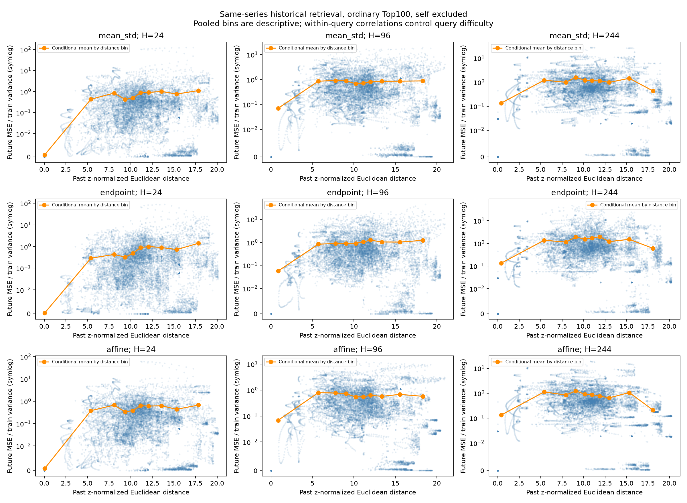
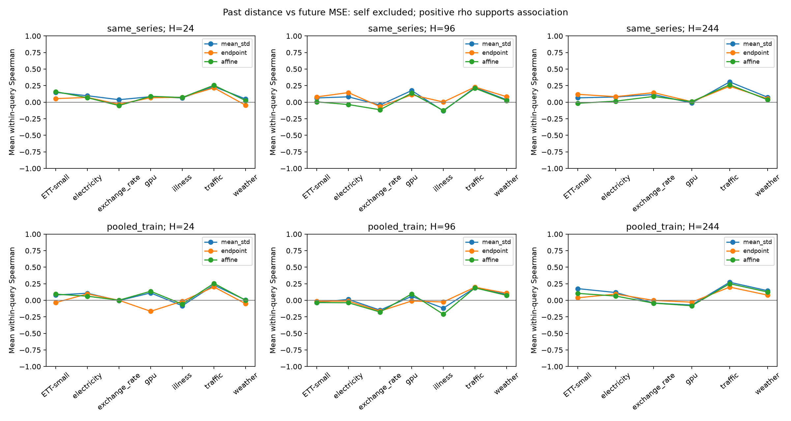
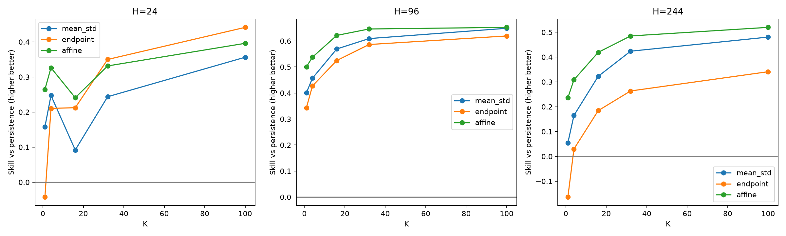

# V4 结论：相似过去能否预测未来？

同序列 9 个 H/映射组合中，9 个平均相关系数为正。**“过去非常像”不能保证“未来非常像”。** 原片段已在检索前排除；当前第一名是真正的其他历史案例。

## 范围

- 35 条逻辑序列，1,032,034 个去重原始采样点；训练记忆 619,213 点。范围限于输入的既有索引，不代表全部原 CSV / 全量 GPU。
- 各 H 查询数：H=24: 123, H=96: 123, H=244: 117；两个检索范围共 726 次。
- 上下文 L=244；训练为每条序列前 60%。候选 past+future 都在训练段。只取其他合法历史，排除自身及重叠。
- 无合法不相交测试段的序列/H 组合共 3 个，明细见 summary.json 的 skipped。小样本组不能当成充分验证。

## 第六项的直接回答

同序列、普通 Top100：对每个查询先计算过去距离和未来误差的 Spearman，再平均。正值说明距离越小，未来误差有偏小的趋势。

| H | mean/std rho | endpoint rho | affine rho |
|---:|---:|---:|---:|
| 24 | 0.110 | 0.054 | 0.090 |
| 96 | 0.077 | 0.093 | 0.027 |
| 244 | 0.114 | 0.116 | 0.070 |

相关性大小与置信区间应结合查看，不能解释为每次最相似候选都提供最好的未来。endpoint 出现负相关的同序列分组：exchange_rate/H=24, exchange_rate/H=96, weather/H=24。

去重后 mean/std 结果：H=24: rho=0.29579461579307414, 邻居数中位数=21.0；H=96: rho=0.30832391354162086, 邻居数中位数=16.0；H=244: rho=0.2807633637601589, 邻居数中位数=11.0。距离范围和候选数量不同，不能归因成纯粹的去重效果。

最近十个 vs 随机历史，mean/std 平均 NMSE：H=24: 0.625 vs 1.320；H=96: 0.713 vs 1.601；H=244: 0.990 vs 2.135。

## 实际零训练预测

固定展示普通 Top-16、加权均值；指标为跨查询平均 NMSE 相对 persistence 的降幅（分母为训练方差）。这里不是 raw MSE 混合不同单位，也没有在测试结果上自动选 K。

| H | mean/std 误差下降 | endpoint 误差下降 | affine 误差下降 |
|---:|---:|---:|---:|
| 24 | 9.2% | 21.2% | 24.1% |
| 96 | 56.9% | 52.5% | 62.1% |
| 244 | 32.3% | 18.4% | 41.9% |

这支持继续研究 analog forecasting，但并非每条查询都提升，也尚未与训练型预测模型比较。三种映射中 affine 在这个固定 K 的汇总较好，不能仅凭本次测试将其认定为所有数据集最优。

## 效率与不足

| 范围 | 检索 P50 | 检索 P95 |
|---|---:|---:|
| same_series | 15.30 ms | 49.90 ms |
| pooled_train | 112.97 ms | 205.03 ms |

时间是常驻索引 + 有界 8192 候选池 + 普通/去重结果构造，不含冷启动，也不含离线评分。跨序列池未满足每次 100ms；没有做 10B 外推。

自匹配/时间重叠违规数：0。去重结果未完整认证：same_series 48/363；pooled_train 136/363。这部分只能解释为已返回前缀，不能宣称找到 100 个独立案例。

## 下一步判断

可以进入 predictive reranker 的研究，但应先固定独立验证/测试划分，用未来误差监督训练排序器，并将跨序列时间可用性按真实时间戳建模。当前阶段完成的是一至六的零训练检验；没有用测试 future 去训练或选择检索器。

[详细分组统计和置信区间](REPORT.md) · [全部机器可读结果](summary.json)

