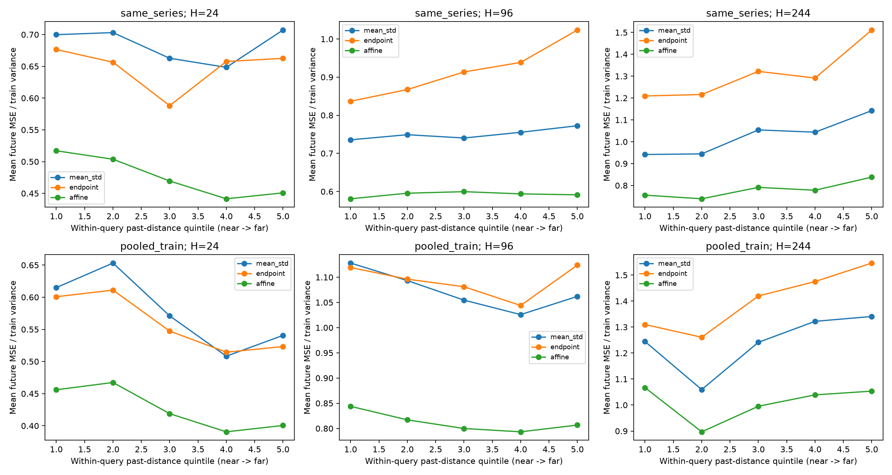
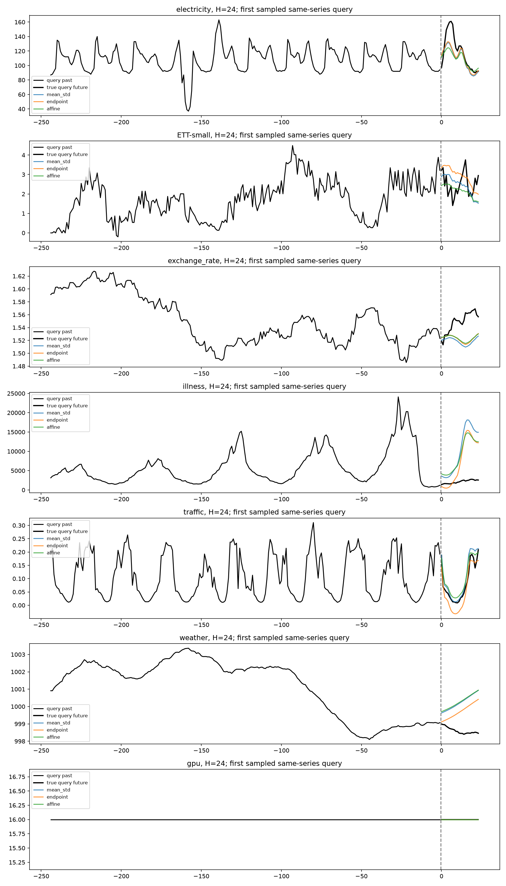

# V4 实验报告

查询自身在候选资格筛选阶段排除。索引和频率/分箱仅用各序列前 60%；候选历史及未来全部位于训练段。

数据：1,032,034 个去重原始点，619,213 个训练点；不是全量 GPU/10B 验证。

same_series 是同文件、列、设备的严格过去检索。pooled_train 是各序列训练前缀组成的离线外部案例库；未对齐跨文件绝对时间，不能解释为全局在线历史实验。

## 六：过去距离与未来误差

正相关表示过去更远通常对应未来误差更大。下表为每个查询 Spearman 的平均值，置信区间按逻辑序列整簇重采样；未把候选对当独立样本。

| 范围 | H | 映射 | 查询数 | 有效相关查询 | rho | 95% CI | Top10 NMSE | 随机 NMSE |
|---|---:|---|---:|---:|---:|---|---:|---:|
| same_series | 24 | mean_std | 123 | 111 | 0.10989358049905532 | [0.04986524907804975, 0.1757710704221768] | 0.6251 | 1.32 |
| same_series | 24 | endpoint | 123 | 111 | 0.054437485278054525 | [0.0036613238667688014, 0.1167581673364948] | 0.6412 | 1.296 |
| same_series | 24 | affine | 123 | 111 | 0.09025394052395157 | [0.018502821596990186, 0.17444769519669054] | 0.4822 | 0.5407 |
| same_series | 96 | mean_std | 123 | 115 | 0.07735361471080986 | [0.012249196373320122, 0.1365454017779653] | 0.7127 | 1.601 |
| same_series | 96 | endpoint | 123 | 114 | 0.09317106139576874 | [0.017114984263123165, 0.16022509365050572] | 0.809 | 2.233 |
| same_series | 96 | affine | 123 | 115 | 0.026584576253399012 | [-0.04813099636192812, 0.09951465910987489] | 0.5803 | 0.7019 |
| same_series | 244 | mean_std | 117 | 108 | 0.11396989052774988 | [0.055932389360286175, 0.1658757656119507] | 0.9899 | 2.135 |
| same_series | 244 | endpoint | 117 | 107 | 0.1159446996385108 | [0.06845539963971568, 0.16041546671453627] | 1.204 | 2.597 |
| same_series | 244 | affine | 117 | 108 | 0.06962762314868282 | [0.004167876642347252, 0.13240271681753213] | 0.7915 | 0.8629 |
| pooled_train | 24 | mean_std | 123 | 111 | 0.08105865782126787 | [0.006833066051547742, 0.15067333622866835] | 0.5436 | 0.9945 |
| pooled_train | 24 | endpoint | 123 | 111 | 0.02598970219703033 | [-0.0494845385070486, 0.08997306528886867] | 0.5453 | 1.019 |
| pooled_train | 24 | affine | 123 | 111 | 0.08282687967680603 | [0.011372005113756413, 0.15561884178719748] | 0.4127 | 0.5203 |
| pooled_train | 96 | mean_std | 123 | 115 | 0.02217174092030852 | [-0.05949968084506635, 0.09871873955767788] | 1.078 | 1.607 |
| pooled_train | 96 | endpoint | 123 | 115 | 0.018316987441840744 | [-0.0697184013486167, 0.09452583562341171] | 1.063 | 2.029 |
| pooled_train | 96 | affine | 123 | 115 | 0.007273893870774798 | [-0.08419201881314525, 0.08338113737087706] | 0.8309 | 0.8463 |
| pooled_train | 244 | mean_std | 117 | 107 | 0.1180111941984309 | [0.053641668681155885, 0.18095075878386965] | 1.33 | 1.764 |
| pooled_train | 244 | endpoint | 117 | 107 | 0.07266235600583838 | [0.006318809795562257, 0.12138381519433358] | 1.278 | 2.154 |
| pooled_train | 244 | affine | 117 | 107 | 0.08602838779246684 | [0.024402385055331727, 0.1445386344500739] | 1.137 | 0.8391 |

## 时间与排除校验

以下为常驻索引检索时间；analysis 包含三种映射、随机对照、所有 K 的均值/中位数预测、相关性统计和结果写入，不是单次在线预测耗时。

```json
[
  {
    "scope": "same_series",
    "queries": 363,
    "retrieval_p50_ms": 15.301499999623047,
    "retrieval_p95_ms": 49.903989999438544,
    "analysis_p50_ms": 14.197800002875738,
    "incomplete_episode_queries": 48,
    "self_or_overlap_violations": 0
  },
  {
    "scope": "pooled_train",
    "queries": 363,
    "retrieval_p50_ms": 112.97240000203601,
    "retrieval_p95_ms": 205.02829000215561,
    "analysis_p50_ms": 17.564400000992464,
    "incomplete_episode_queries": 136,
    "self_or_overlap_violations": 0
  }
]
```

## 解释限制

- 正相关属于观察性预测信息，不是因果证明；Top100 距离范围窄，弱相关不代表完全无用。
- ordinary 候选彼此可能重叠；episodes 额外要求间隔至少 L+H。两组均排除 query，episode 候选不足不填充。
- 平坦历史不识别未来幅度：三种映射均退回 query 尾值；相关性未定义的查询单独计数。
- NMSE 分母为 query 所属序列训练方差（最小 1e-12），不是未知未来方差。raw MSE 也保存在明细。
- 权重温度 tau=max(median(d_past^2),1e-8)，仅用过去距离。K=1,4,16,32,100 全部报告，不在测试集上挑参数后宣称泛化增益。
- illness 的 H=244 无法同时容纳训练历史及不相交测试上下文/未来，按 skipped 记录。不同 H 的可用查询不完全相同。
- 各数据组包含的独立文件/序列较少，置信区间仅作探索；需要更多独立数据与固定训练/验证/测试划分复验。





