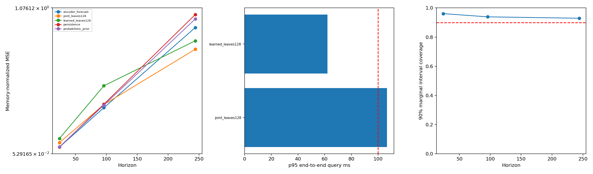

# 同时检索历史相似、未来有参考价值的片段

这是本轮按最新目标补充的主方案，仍在同一个 V6 分支。先前的 [索引加速与融合实验](OPTIMIZATION.md) 作为对照保留；**预测融合不是本方案判断检索是否有效的依据**。

## 1. 检索目标

对数据库候选 c 与查询 q：

\[
\min_c\; (1-\alpha)\|e_q-e_c\|^2 + \alpha\|h_q-h_c\|^2,
\quad d_{\rm raw\ history}(q,c)\le\tau.
\]

- e：学习的未来概率编码；旧模型也能先用于对照。
- h：历史形状向量，默认 32 维。
- α 默认 0.5，τ 默认 0.5；只允许依据 validation 调整。
- 原始历史距离是对历史做均值/标准差归一化、使用 memory 尺度下限后计算的逐点 MSE。它衡量形状相似；不要求原始幅值完全相同。

联合向量为 `[sqrt(1-α)e, sqrt(α)h]`，因此普通向量距离就能精确实现加权目标。默认共 64 维。


查询从不读取自己的真实未来。原始历史门槛可以直接核验；未来只能预测其可能性，不能保证尚未发生的未来一定相似。

## 2. 如何避免训练只学过去、或者只学未来

新配置包含：

1. **历史近邻批次**：半批从历史形状邻域采样，另半批为随机样本。邻域树只读取历史，真正的未来仅用于训练监督。重点比较“过去相像、后续不同”的例子。
2. **联合软目标**：真实未来/概率教师目标再乘以历史相似度核。未来相似但历史差异很大的样本，不再获得同样高的正样本权重。
3. **历史重建辅助损失**：编码必须保留历史形状信息；同时保留未来预测、概率特征重建和表示方差/协方差约束。
4. **推理时独立历史支路与硬门槛**：即便学习编码丢掉一些历史细节，最终候选仍必须经过完整历史核验。

历史近邻采样使用 cKDTree，保存训练样本的历史摘要，不保存全体两两距离。批次会重复利用近邻，不保证每个 epoch 恰好遍历所有样本一次。特征和邻域都只来自训练区间；validation/test 不参与网络更新。

## 3. 初步实测：没有重新训练网络

先用服务器旧 checkpoint 构造 joint 索引，检验联合排序和历史门槛本身。α=0.5、τ=0.5 固定后，在 validation 比较叶块预算，再选择 128。

### 验证集预算选择

在完整联合搜索能返回 10 段的 60 个 validation 查询上：

|叶块预算|相对完整联合搜索的候选 ID Recall|
|---:|---:|
|32|85.33%|
|64|96.83%|
|128|99.50%|

这是对**编码＋历史门槛**检索结果的召回，不是真实未来 oracle 召回。完整模式另外有 4 个查询未返回满 10 段，不包含在该 Recall 分母中；未隐藏缺额统计。

### 留出 test 上的候选本身

同一 64 个 test 查询，比较相同 128 叶块预算下的 learned 与 joint。仅在两者均返回完整 10 段的 **60 个共同查询**上配对：

|指标，越低越好|learned|joint|变化|
|---|---:|---:|---:|
|候选平均历史 NMSE|0.50293|0.18928|降低 62.4%|
|候选平均真实未来 NMSE，H=244|15.06905|12.71018|降低 15.7%|

两项误差分别衡量历史与后续片段本身，不是最终加权预测误差。候选未来先用过去的均值/标准差对齐，再以查询历史尺度归一化。

未来改善的逐查询胜率只有 **46.7%**，按 4 个序列簇 bootstrap 的平均改善 95% 区间约 **[-2.32,6.68]**，跨零。因此现在只能说均值改善，不能说大多数查询或其他数据集一定改善。

全部 64 个 test 查询均有返回；60 个返回满 10 段，平均返回 9.5625 段。所有返回候选的历史 NMSE 最大 **0.49744 ≤ 0.5**。若候选不足，保留不足状态，不放宽门槛或偷偷补入不相似数据。

### 对最终预测的影响（不使用融合）

|H|learned 预测 NMSE|joint 预测 NMSE|最后值预测 NMSE|
|---:|---:|---:|---:|
|24|0.15955|0.13083|0.09957|
|96|0.52973|0.39768|0.40046|
|244|0.84549|0.78610|1.02961|

历史约束也改善了三个 horizon 的预测均值，但短期仍不如最后值预测。尚未证明 joint 稳定优于纯 history 检索；新编码器重训后需继续做对应消融。

### 速度和限制

此次 CPU 单线程 test 测量，joint 的 p50 **65.65ms**、p95 **106.65ms**、最大 **116.79ms**，90.6% 查询在 100ms 内。联合约束增加了维度和原始历史核验，不能套用纯 learned 加速实验中“全部小于 100ms”的结论。

128 叶块模式是近似搜索；不声明完整性。完整模式且返回满 k 时，精确性针对联合向量距离、历史门槛和非重叠规则，不针对不可见的真实未来。

[详细配对统计](docs/joint/test_analysis.json) · [回传分析包](docs/joint/analysis_bundle.zip) · [验证集预算统计](docs/joint/validation_budgets.json)



## 4. 服务器运行

### 不重训，先复现联合检索

```bash
git switch v6-bayesian-future-retrieval
git pull --ff-only
python -m v6 repack --index runs/v6_nrel/index \
  --output v6/runs/joint/index --channels learned joint \
  --joint-history-weight 0.5 --history-max-nmse 0.5
python -m v6 evaluate --store runs/v5_nrel/store \
  --checkpoint runs/v6_nrel/encoder/best.pt --index v6/runs/joint/index \
  --output v6/runs/joint/validation --split validation --device cuda \
  --channels joint --leaf-budgets 0 32 64 128 --audit-queries 0
python -m v6 analyze --results v6/runs/joint/validation
```

原索引需要同时有 learned/history 通道，以便构造 joint。两种通道即使已经分别空间重排，也按原始起点对齐后组合；不将行号当作起点。

选择预算后固定测试，例如 128：

```bash
python -m v6 evaluate --store runs/v5_nrel/store \
  --checkpoint runs/v6_nrel/encoder/best.pt --index v6/runs/joint/index \
  --output v6/runs/joint/test --split test --device cuda \
  --channels learned joint --leaf-budgets 128 --audit-queries 0
python -m v6 analyze --results v6/runs/joint/test
```

### 训练真正同时保留两类信息的编码器

```bash
python -m v6 configure --source v6/nrel.local.json --output v6/configs/local.joint.json
python -m v6 train --stage encoder --config v6/configs/local.joint.json \
  --store runs/v5_nrel/store --prior runs/v6_nrel/prior/best.pt \
  --output v6/runs/joint_trained/encoder --device cuda
python -m v6 index --store runs/v5_nrel/store \
  --checkpoint v6/runs/joint_trained/encoder/best.pt \
  --output v6/runs/joint_trained/index --device cuda
```

这是新的编码器初始化与训练，不能 resume 到旧结构。可先复用原 prior；要检验多 horizon 概率训练，再先训练新的 prior 作额外对照。新配置默认同时建 learned/history/belief/joint，便于消融；正式服务只需 joint，可在训练前配置 `index.channels=["joint"]` 节省存储。

单次 query 支持 `--channel joint --leaf-budget 128`；库中存在 joint 时默认选择它。若显式加载融合权重，则默认选择该权重绑定的检索通道。建议先评价裸 joint，之后才单独考察融合收益。

## 5. 回传结果与下一步判断

`analysis.json` 新增：

- `candidate_similarity`：候选历史/未来误差、每个 horizon、无匹配查询数量。
- `candidate_paired_comparisons`：相同预算、双方都满 k 的共同查询上的双向相似性配对比较。
- `timing.mean_returned/no_match_fraction`：返回不足，避免只看筛选后的漂亮均值。

新训练效果必须同时检查历史门槛、候选真实未来相似度、预测误差和时间；不以某一个指标替代其他指标。网络尚未在本地重训，上面的收益来自旧模型上的联合检索约束。
