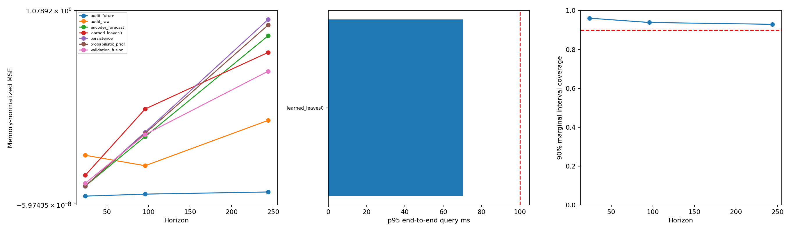

# V6 服务器结果复查与本轮优化

后续按“候选历史与未来都相似”的最新要求增加了 [联合检索方案与实测](JOINT_RETRIEVAL.md)。本文纯 learned 的速度数字不适用于额外执行历史门槛的 joint 通道；融合实验也不代表候选自身的双向相似性。

本轮直接更新 `v6-bayesian-future-retrieval`，不新建版本分支、不拆分 patch。以服务器提交 `3a91cda` 为基础，保留上传的结果、checkpoint、索引和对比绘图代码。

## 1. 服务器结果说明了什么

数据库 596,945 个合法窗口，4 条逻辑序列，测试查询 64。

|H|原 learned 检索 NMSE|history 检索 NMSE|最后值预测 NMSE|
|---:|---:|---:|---:|
|24|0.15955|0.15575|0.09957|
|96|0.52973|0.36697|0.40046|
|244|0.84548|0.77213|1.02961|

- 当前学习编码尚未稳定胜过历史检索。H=96 的配对差异尤其不利；4 个序列的置信区间仍有局限。
- 编码有效秩只有约 **2.52/32**，平均维度标准差约 0.056。这是表示集中于少数方向的迹象，不足以单独证明退化是所有预测问题的原因。
- learned 完整搜索平均评分约 **73.8%** 的库，时间相邻窗口的包围盒太宽，分层结构没有充分剪枝。
- 三个 horizon 的 90% 区间覆盖率约 0.961、0.939、0.929，略偏保守；不能用概率覆盖率替代检索召回率。
- 服务器新增的六例对比图曾按真实未来是否含零筛选，并把未来误差标签写为 hist-NMSE；这不能作为总体收益证据。本轮改为只按历史选示例，并明确未来误差的标签。

## 2. 已落地的优化

### 分片内按向量几何组织多层索引

仍先划分时间长段。每个分片内，各通道按最大跨度维度作中位数划分，再建立多层包围盒。每个通道保留自己的原始起点映射，因此最终返回实际数据位置。

- 旧向量可以直接 `repack`，不重训、不重新编码。
- 每个通道单独重排，避免 learned 的布局牺牲 history 通道。
- 保存所有原向量及合法起点，完整搜索的目标距离、排除条件和并列规则不变。
- 增大有界文件映射缓存；将逐候选 Python 堆操作改为批量有界 Top-M 选择。
- 始终只保存 M 个候选距离和当前叶块距离，不保存全库距离。

### 概率编码与训练目标

新配置默认使用 **CDF 概率特征**：固定阈值下的未来累积分布、均值与方差摘要。交换混合分布的模式编号，特征不变。旧按模式编号拼接的向量没有这个性质。

新增训练约束：

- 检索向量的方差下限与非对角协方差惩罚，减少各维重复表达同一方向。思路参考 [VICReg 原论文](https://arxiv.org/abs/2105.04906)，不是其图像训练方案的完整复现。
- 将真实未来监督与冻结概率分布的相似性软目标混合，默认概率教师占 0.2。
- prior 的负对数似然对 24、96、244 三个 horizon 等权平均，避免只用最长 horizon 的目标。

旧配置缺少这些字段时使用旧行为，旧 checkpoint 仍可直接推理。CDF 编码器和新的损失需要服务器重新训练；本地没有更新任何神经网络权重。

### 只用 validation 的预测融合

保留裸 learned 检索预测，并单独输出 `validation_fusion`。融合最后值预测、编码器预测、概率均值和 learned 类比预测。

- 只允许完整 validation 结果拟合权重；明确拒绝 test。
- 不保存训练用的原始未来数组，只积累误差内积矩阵。
- 在 [0,24)、[24,96)、[96,244) 分段拟合非负、和为 1 的权重；分段切换可能产生不连续。
- 权重绑定数据、checkpoint、索引 manifest、检索预算、k、scope、冗余量，防止套到不同检索方案。
- 生产查询可一次编码和一次检索完成融合，无需额外搜索其他通道。它不保证每次都改进，也不能用融合收益证明编码本身已经学好。

## 3. 已测量的速度变化

使用服务器已有权重和全量 596,945 窗口；同一 Windows `tslib` CPU、1 个计算线程。抽取 16 个 validation 查询，每种方法先等量预热，再随机交错执行两遍，共每方法 32 次。

|方法|p50 ms|p95 ms|最大 ms|平均评分窗口比例|位置及排序与原完整搜索一致|
|---|---:|---:|---:|---:|---:|
|服务器提交中的原实现|103.26|232.31|271.13|72.72%|100%|
|仅运行时优化，原时间布局|98.30|236.76|349.98|72.72%|100%|
|空间布局＋完整搜索|34.58|70.96|74.26|17.16%|100%|
|空间布局＋128 叶块预算|35.59|85.27|95.54|16.34%|100%（本样本）|

原始测量见 [benchmark.json](docs/optimization/benchmark.json)。完整搜索 p50 约快 **2.99 倍**，p95 约快 **3.27 倍**。主要收益来自布局，不能将全部提升归因于缓存。

预算模式本次没有更快；完整搜索也已足够快。预算模式的样本 Recall=1 不构成普遍精确保证。

这是已加载模型、数据页预热后的服务查询测量，不是严格冷启动。独立的 64 个 test 查询完整搜索 p95 **70.32ms**、最大 **89.28ms**，本次全部低于 100ms。仍不能据此保证任意硬件、冷缓存、并发或 10B 数据都低于 100ms。

## 4. 已测量的预测变化

冻结原神经网络，仅用 64 个 validation 查询拟合少量融合权重，然后在与服务器相同的 64 个 test 查询评估；未根据 test 重新调权。

|H|裸 learned NMSE|验证集融合 NMSE|最后值预测 NMSE|融合相对最后值 skill|
|---:|---:|---:|---:|---:|
|24|0.15955|0.11517|0.09957|-15.7%|
|96|0.52973|0.38730|0.40046|+3.3%|
|244|0.84549|0.74056|1.02961|+28.1%|

H=244 相对裸 learned 降低误差约 **12.4%**。H=24 仍不如最后值预测，不能宣布短期问题已解决；H=96 的配对收益区间跨零。H=244 对最后值预测的平均 NMSE 改善约 0.289，按序列簇 bootstrap 的 95% 区间约 [0.243,0.342]，但只有 4 个序列，外推需谨慎。

空间重排没有改变原编码目标，因此裸 learned 的预测误差基本不变。与服务器极小的数值差别来自 CPU/GPU 浮点计算；同机前后比较的候选位置与排序一致。

- [详细配对统计](docs/optimization/test_analysis.json)
- [本次分析包](docs/optimization/analysis_bundle.zip)
- [融合权重及绑定信息](docs/optimization/fusion.json)



图及测试统计产生于新增融合耗时单独记录之前，所以该已归档图仅显示裸检索耗时；当前代码会另外记录“检索实测＋融合运算”时间。不要把该归档裸检索耗时当作融合耗时。

## 5. 服务器怎样继续

### 立即使用已有模型提速

```bash
git switch v6-bayesian-future-retrieval
git pull --ff-only
python -m v6 repack --index runs/v6_nrel/index \
  --output v6/runs/nrel_spatial/index --channels learned
python -m v6 evaluate --store runs/v5_nrel/store \
  --checkpoint runs/v6_nrel/encoder/best.pt --index v6/runs/nrel_spatial/index \
  --output v6/runs/nrel_spatial/validation --split validation --device cuda --leaf-budgets 0
python -m v6 calibrate --results v6/runs/nrel_spatial/validation \
  --output v6/runs/nrel_spatial/fusion.json --method learned_leaves0
python -m v6 evaluate --store runs/v5_nrel/store \
  --checkpoint runs/v6_nrel/encoder/best.pt --index v6/runs/nrel_spatial/index \
  --output v6/runs/nrel_spatial/test --split test --device cuda --leaf-budgets 0 \
  --fusion v6/runs/nrel_spatial/fusion.json
python -m v6 analyze --results v6/runs/nrel_spatial/test
```

输出目录要新建。`repack` 每次写入自己的 manifest 身份，所以应在新库上重新生成验证统计和融合权重，不直接复制本地测量的 fusion.json。

### 训练改进后的编码器

```bash
python -m v6 configure --source v6/nrel.local.json --output v6/configs/local.optimized.json
python -m v6 train --stage encoder --config v6/configs/local.optimized.json \
  --store runs/v5_nrel/store --prior runs/v6_nrel/prior/best.pt \
  --output v6/runs/nrel_optimized/encoder --device cuda
python -m v6 index --store runs/v5_nrel/store \
  --checkpoint v6/runs/nrel_optimized/encoder/best.pt \
  --output v6/runs/nrel_optimized/index --device cuda
```

`configure` 保留服务器的数据路径、采样数、seed、批大小、epoch，只打开新特征/约束和空间布局。旧的 `nrel.local.json` 不会被覆盖。

以上复用原 prior，仅检验新编码器。若要检验多 horizon 概率目标，先用新配置运行 `train --stage prior` 到新目录，再将该新 prior 传给 encoder。不能向旧 checkpoint `--resume` 后修改模型结构或损失配置。

完成后按 validation → 固定方案 → test → analyze 的顺序评估，比较裸 learned、无 belief 消融、history、最后值与融合。要比较 history 通道，repack 时保留全部通道，或使用新配置默认的三通道 index。

### 单次带融合查询

在原 query 命令上增加 `--fusion /path/to/fusion.json`，且 leaf-budget、索引、k、scope 等必须与校准时一致。模型/索引对象应在服务进程内复用。

## 6. 复杂度与代价

新空间划分在每个最多 S 个窗口的时间分片内进行，构建约 `O(N·d·log(S/L))`，L 是叶大小；单分片临时向量副本占 `O(Sd)`，不把全库载入 GPU。

查询设 V 为访问节点数、R 为访问叶数、C 为评分窗口数、M 为冗余候选上限：

`O(Vd + V log B + Cd + R(M+L) + ties + M log M + Mk)`，B 为库中叶块数。`ties` 是同距离候选排序成本，最坏每叶 `O((M+L) log(M+L))`。最坏仍可能扫描全库，没有对数时间保证。

各空间通道另外保存 `8N` 字节起点映射；根目录保留 `8N` 的原始位置集合用于审计。learned-only 32 维时，100 亿起点的向量约 1.28TB，两个起点数组约 160GB，边界、原始数据另计。当前 596,945 窗口的 learned-only 重排库为 86,611,344 bytes。

## 7. 验证与未完成的实验

- 本地 V6 13 项测试通过，包含 CPU/CUDA AMP、CDF 模式交换不变性、批量候选并列排序、重排/重复重排一致性、验证集融合限制与身份校验。
- 实际服务器 checkpoint 已成功加载并完成推理，不更新网络权重。
- CDF＋方差/协方差约束＋概率教师的新训练效果尚未测量，不能将旧模型融合结果归功于新编码器。
- 后续重点是多 seed/多数据集的短期预测、裸 learned 相对 history 的配对收益，以及更大库和冷缓存的延迟。
