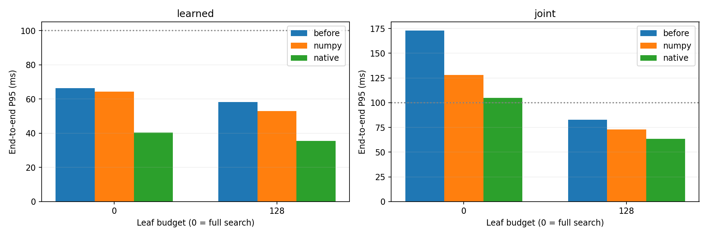

# V6 检索优化同机对照

基线提交：`48dceda8525341f6d4f256a004f06ec06258a048`；索引窗口数：596,945。

模型与索引冻结，不训练、不改门槛、不减少候选池。耗时包含编码、检索、历史门槛及候选未来读取；排除启动成本。

|通道|叶预算（0=完整）|实现|P50 ms|P95 ms|最大 ms|≤100ms|同预算位置召回|对完整搜索召回|暴力核验召回|返回完整K比例|预测最大差异|
|---|---:|---|---:|---:|---:|---:|---:|---:|---:|---:|---:|
|learned|0|before|43.73|66.39|100.80|98.44%|100.00%|100.00%|100.00%|100.00%|0|
|learned|0|numpy|36.33|64.34|95.50|100.00%|100.00%|100.00%|100.00%|100.00%|0|
|learned|0|native|25.63|40.41|47.86|100.00%|100.00%|100.00%|100.00%|100.00%|0|
|learned|128|before|39.36|58.28|70.10|100.00%|100.00%|100.00%|100.00%|100.00%|0|
|learned|128|numpy|34.77|52.90|68.76|100.00%|100.00%|100.00%|100.00%|100.00%|0|
|learned|128|native|24.48|35.41|39.25|100.00%|100.00%|100.00%|100.00%|100.00%|0|
|joint|0|before|96.96|172.86|216.83|56.25%|100.00%|100.00%|100.00%|96.88%|0|
|joint|0|numpy|76.13|128.01|164.66|76.56%|100.00%|100.00%|100.00%|96.88%|0|
|joint|0|native|60.49|104.72|133.87|90.62%|100.00%|100.00%|100.00%|96.88%|0|
|joint|128|before|53.75|82.81|128.33|96.88%|100.00%|100.00%|100.00%|96.88%|0|
|joint|128|numpy|46.44|72.88|92.92|100.00%|100.00%|100.00%|100.00%|96.88%|0|
|joint|128|native|29.21|63.39|113.19|98.44%|100.00%|100.00%|100.00%|96.88%|0|

每项查询数：32；每查询重复 2 次；暴力审计 8 条查询。

同预算召回衡量新旧实现是否一致。128 叶是近似预算，不能用同预算的 100% 取代相对完整搜索的召回。
完整搜索与暴力审计均遵守现有 TopM 后历史门槛和非重叠筛选语义；不足 K 个时不保证全库满足门槛的非重叠 TopK 已找齐。
本报告衡量检索实现的速度及输出保持情况，不证明未来相似度或预测质量提升。

[完整逐查询数据](benchmark.json)

