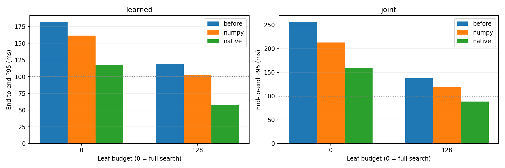

# V6 检索优化同机对照

基线提交：`48dceda8525341f6d4f256a004f06ec06258a048`；索引窗口数：596,945。

模型与索引冻结，不训练、不改门槛、不减少候选池。耗时包含编码、检索、历史门槛及候选未来读取；排除启动成本。

|通道|叶预算（0=完整）|实现|P50 ms|P95 ms|最大 ms|≤100ms|同预算位置召回|对完整搜索召回|暴力核验召回|返回完整K比例|预测最大差异|
|---|---:|---|---:|---:|---:|---:|---:|---:|---:|---:|---:|
|learned|0|before|89.00|182.17|234.14|58.33%|100.00%|100.00%|100.00%|100.00%|0|
|learned|0|numpy|80.81|161.49|297.32|72.40%|100.00%|100.00%|100.00%|100.00%|0|
|learned|0|native|58.28|117.52|169.19|91.67%|100.00%|100.00%|100.00%|100.00%|0|
|learned|128|before|70.98|118.97|185.21|85.42%|100.00%|100.00%|100.00%|100.00%|0|
|learned|128|numpy|60.81|102.21|128.65|94.27%|100.00%|100.00%|100.00%|100.00%|0|
|learned|128|native|39.51|57.60|79.60|100.00%|100.00%|100.00%|100.00%|100.00%|0|
|joint|0|before|153.41|256.68|370.72|15.62%|100.00%|100.00%|100.00%|93.75%|0|
|joint|0|numpy|124.03|212.87|274.66|23.96%|100.00%|100.00%|100.00%|93.75%|0|
|joint|0|native|96.20|159.71|204.08|52.60%|100.00%|100.00%|100.00%|93.75%|0|
|joint|128|before|85.04|138.27|194.17|74.48%|100.00%|100.00%|100.00%|93.75%|0|
|joint|128|numpy|74.14|119.06|178.49|87.50%|100.00%|100.00%|100.00%|93.75%|0|
|joint|128|native|49.17|88.64|143.58|97.40%|100.00%|100.00%|100.00%|93.75%|0|

每项查询数：64；每查询重复 3 次；暴力审计 8 条查询。

同预算召回衡量新旧实现是否一致。128 叶是近似预算，不能用同预算的 100% 取代相对完整搜索的召回。
完整搜索与暴力审计均遵守现有 TopM 后历史门槛和非重叠筛选语义；不足 K 个时不保证全库满足门槛的非重叠 TopK 已找齐。
本报告衡量检索实现的速度及输出保持情况，不证明未来相似度或预测质量提升。

[完整逐查询数据](benchmark.json)

