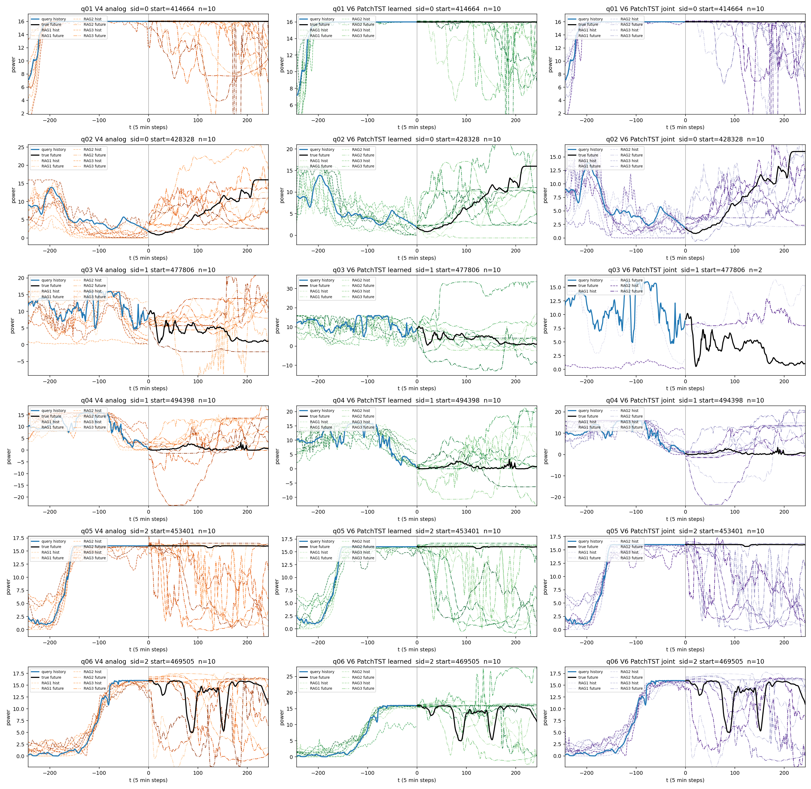

# PatchTST V6: train then search

CNN backbone replaced by univariate PatchTST (`patch_len=16`, `stride=8`, 4 heads, 2 layers, hidden=64). Prior and encoder were trained from scratch, then a spatial joint index was built over 596,945 windows and searched on the same 64 NREL test queries.

- Config: `v6/nrel.patchtst.json`
- Checkpoints / index / eval: `runs/v6_nrel_patchtst/`
- Cases: `v6/nrel_vis_patchtst/`
- CNN remains the default backbone; old CNN checkpoints cannot be resumed into PatchTST.

Prior val NLL 1.154 (epoch 15) vs CNN ~1.78. Encoder val 4.071 (epoch 13), similar to CNN.

## Forecast NMSE (memory-normalized, 64 queries)

Same analog mapping for every retrieval method.

|H|persistence|V4 analog|CNN joint|PatchTST joint|CNN learned|PatchTST learned|
|---:|---:|---:|---:|---:|---:|---:|
|24|0.09957|0.15938|0.12740|0.12255|0.12484|0.13976|
|96|0.40046|0.38372|0.40098|0.36149|0.54944|0.40138|
|244|1.0296|0.78867|0.79874|0.75925|1.0767|0.73035|

Paired Δ NMSE, series-clustered 95% CI (positive = left method better):

|H|PatchTST joint vs V4|PatchTST joint vs CNN joint|PatchTST learned vs CNN learned|
|---:|---|---|---|
|24|+0.037 [0.029, 0.045], win 68.8%|+0.005 [-0.0004, 0.010], win 56.2%|-0.015, CI crosses 0|
|96|+0.022, CI crosses 0|+0.039, CI crosses 0|+0.148 [0.030, 0.291]|
|244|+0.029, CI crosses 0|+0.039, CI crosses 0|+0.346 [0.227, 0.457]|

Retrieved-candidate errors (query-history scale): PatchTST joint history NMSE 0.208 (max 0.500, gate held), future 10.97 vs CNN joint 12.21. PatchTST learned future 13.04 vs CNN learned 16.57.

H=24 still loses to persistence. H=244 PatchTST learned (no history gate) is the strongest retrieval forecast.

## Case studies

History-only example filter; not a benchmark. Candidate future NMSE uses query-history scale after past-only mean/std mapping.

|Query|sid|start|V4 analog n|V4 analog histNMSE|V4 analog futNMSE|V4 analog forecast|V6 PatchTST learned n|V6 PatchTST learned histNMSE|V6 PatchTST learned futNMSE|V6 PatchTST learned forecast|V6 PatchTST joint n|V6 PatchTST joint histNMSE|V6 PatchTST joint futNMSE|V6 PatchTST joint forecast|
|---|---:|---:|---:|---:|---:|---:|---:|---:|---:|---:|---:|---:|---:|---:|
|q01|0|414664|10|0.02263|6.341|2.745|10|0.04942|2.97|1.434|10|0.02559|4.894|1.883|
|q02|0|428328|10|0.169|4.026|1.422|10|0.3241|3.829|1.373|10|0.1893|2.377|1.183|
|q03|1|477806|10|0.5742|5.641|2.919|10|1.425|10.26|1.065|2|0.475|5.358|5.489|
|q04|1|494398|10|0.2436|3.476|1.278|10|0.4152|2.627|0.6765|10|0.2626|4.745|1.866|
|q05|2|453401|10|0.0175|1.768|0.8597|10|0.02198|2.027|1.108|10|0.01794|2.014|0.9321|
|q06|2|469505|10|0.01868|1.041|0.2954|10|0.0306|0.9252|0.3328|10|0.01982|0.9848|0.3032|

